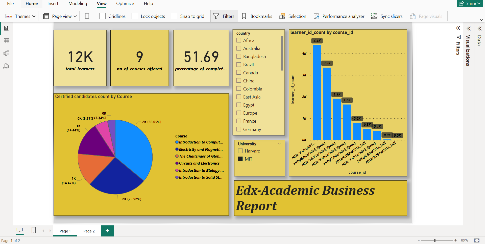
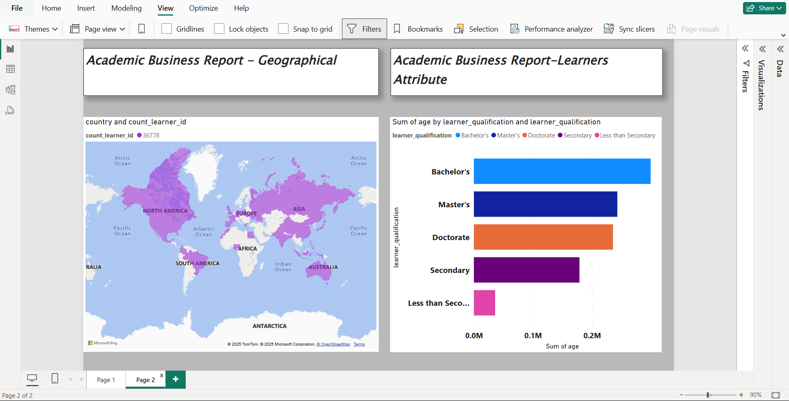

#  E-Learning Analysis Dashboard – Power BI

This project presents an interactive Power BI dashboard built from E-Learning (EdX) dataset, offering key insights into academic engagement and learner demographics.

##  Dashboard Overview

###  Academic Business Report – Summary
- **Total Learners**: Displays the total number of unique learners enrolled.
- **Number of Courses Offered**: Shows total count of distinct courses available.
- **Course Completion Status (%)**
- **Certified Participants **: Number of Certified candidates for every course

### Academic Business Report – Geographical
- Shows the geographical spread of learners across countries or regions.

### Academic Business Report – Learner Attributes
- **Qualification Distribution**: Shows learners’ academic backgrounds (e.g., Bachelor’s, Master’s).

## Files Included
- `edx_analysis.pbix` – Power BI dashboard file
- `edx.csv` – Dataset used for analysis
- `edx1.png`, `edx2.png` – Dashboard screenshots

##  Dashboard Preview

